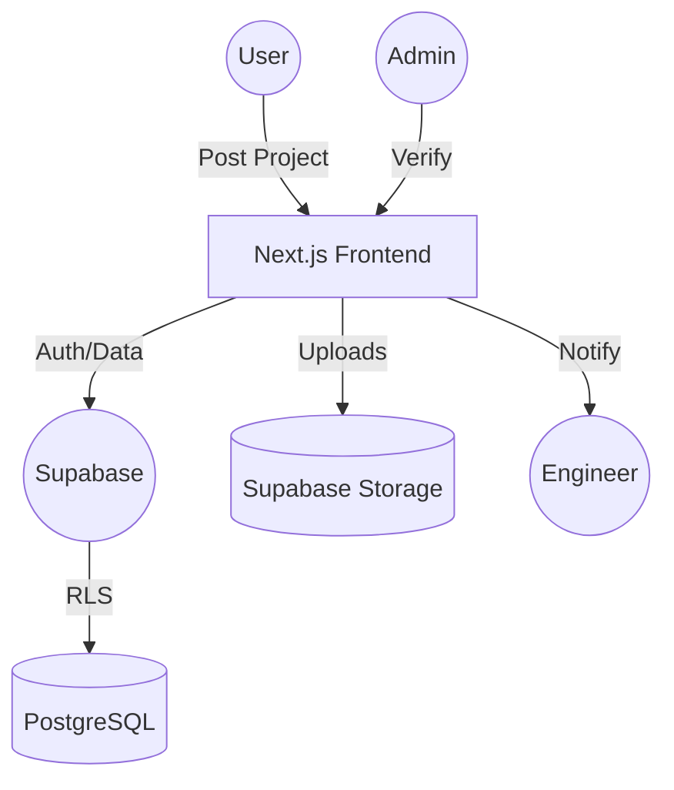

# 🏗️ PLAN 2 BUILD — The Construction Masterclass

> **India's #1 Marketplace for Verified Construction Professionals**

[](https://nextjs.org/)
[](https://supabase.com/)
[](https://tailwindcss.com/)
[](https://lucia-auth.com/)

---

## 🌟 Overview

**PLAN 2 BUILD** is a high-performance, full-stack marketplace designed to bridge the gap between home-owners and construction professionals. Whether you are looking for a **Civil Engineer**, **Architect**, or **Interior Designer**, our platform ensures every lead is vetted and every professional is verified.


---

## 🔥 Key Features

### 🛡️ For Customers
- **Unified Project Posting**: Post requirements with detailed specs, budgets, and timelines.
- **Architecture Uploads**: Send your dream plans directly to engineers via a secure file upload system.
- **Proposal Review**: Browse through professional bids with clear price and timeline breakdowns.
- **Real-Time Messaging**: Chat directly with professionals to finalize details.

### 👷 For Engineers
- **Verification Badging**: Get a blue-tick verified badge by uploading professional certifications.
- **Smart Dashboard**: Manage active proposals, reviews, and notifications in one sleek interface.
- **File Sharing**: Access project-specific architectural docs uploaded by customers.
- **Subscription Model**: Premium tiers for enhanced visibility and lead generation.

### 👑 For Administrators
- **Verification Engine**: Review and badge engineers based on submitted documents.
- **System Control**: Toggle Maintenance Mode instantly for system updates.
- **Live Monitoring**: Track total users, projects, and pending approvals.

---

## 🛠️ The Tech Stack

| Layer | Technology | Role |
| :--- | :--- | :--- |
| **Frontend** | `Next.js 16 (App Router)` | High-performance Server Side Rendering & Client Navigation |
| **Backend** | `Next.js API Routes` | Type-safe serverless functions |
| **Database** | `Supabase (PostgreSQL)` | Robust data persistence with RLS security |
| **Auth** | `Supabase SSR` | Secure cookie-based session management |
| **Storage** | `Supabase Storage` | Encrypted storage for engineering docs and plans |
| **Styling** | `Vanilla CSS + CSS Variables` | Custom, premium "Glassmorphism" design system |

---

## 🏗️ System Architecture



---

## 🚀 Getting Started

### 1. Clone the repository
```bash
git clone https://github.com/your-username/plan2build.git
```

### 2. Install dependencies
```bash
npm install
```

### 3. Setup Environment Variables
Create a `.env.local` file:
```env
NEXT_PUBLIC_SUPABASE_URL=your_url
NEXT_PUBLIC_SUPABASE_ANON_KEY=your_key
```

### 4. Database Setup
Run the SQL found in `supabase_schema.sql` within your Supabase SQL editor to initialize tables and RLS policies.

### 5. Run development server
```bash
npm run dev
```

---

## 🎨 Premium Aesthetics

The project features a **Midnight Glass** design system, combining:
- **HSL-tailored Gold accents** (`#d4a843`) for a premium feel.
- **Dynamic Micro-animations** for button hovers and card entries.
- **Responsible Grid layouts** that scale from high-end desktops to mobile displays.

---

## 🤝 Contributing

We welcome contributions! Please see our [AGENTS.md](AGENTS.md) for specialized guidelines.

---

> Built with ❤️ by the **Nagapavanvarma** team for the future of construction.
